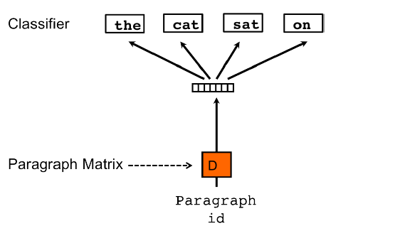

Doc2Vec 논문을 읽고 정리한 노트
=============================

2017.07.27.
-----------

---
## Doc2Vec

### Introduction

bag of words (bow) 방식은 많은 차원이 필요하다. 단어들의 순서나 의미는 사라진 채 백터로 표현될 뿐이다. bag of n-gram은 문장 안의 단어들을 n조각씩 묵어서 표현하므로 순서의 의미가 약간 추가될 뿐이지만 역시 단어들의 의미는 없어지기 마련이다.   
예를들어 "강하다", "힘쌔다", "서울" 등의 단어들이 모두 같은 거리를 가질 수 있고, 오히려 "강하다"와 "서울" 의 거리가 더 가까울 수 있다.  

이 논문에서는 Paragraph vector(이하 PV)를 제안한다. 이 PV는 구문이나 긴 문장의 단어 뭉치들을 적용시킬 수 있다. PV는 하나의 구문안에서 다양한 단어 벡터들을 공유한다.

### Algorithms

#### Paragraph Vector: A distributed memory model

(그림 1)

위 그림 1을 보면, 모든 구문들은 서로 다르게 D 벡터로 만들고 각 단어들 또한 유일한 W 벡터로 만든다. 각 구문벡터와 단어벡터를 합쳐서 새로운 벡터로 만든다.  
구문을 서로 다른 단어들로 토큰화 한다. 그것은 현재의 맥락(context)에서 또는 단락의 주제에서 누락된 것을 기억하는 메모리 역할을 한다. 그래서 우리는 이것은 Distributed Memory Model of Paragraphs(PV-DM). 라고 부르기로 했다.  

문맥들은 고정된 길이로 구문들의 window를 이동하면서 추출된다. 구문 벡터는 모든 생성된 문맥에 공유되고 그 반대는 아니다. 만약 똑같은 단어들이 서로다른 구문에 있다면 각각의 벡터로 생성된다.   

구문벡터와 단어벡터는 stochastic gradient descent방식으로 학습되며 gradient는 backpropagation으로 얻는다. SGD의 각 스텝은 고정된 문맥으로 구문을 바꿔가면서 학습된다. 

예측시에는 새 구문을 학습된 구문에 넣고 추론을 하고 gradient descent를 얻는다. 이 스텝에서는 모델에 대한 나머지 파라미터(단어벡터W와 softmax weight)는 고정된다.  

N개의 구문과 M개의 단어장, 임베딩된 구문벡터는 p차원으로 작아지고 단어벡터는  q차원으로 작아진다. 그러면 N x p + M x q 개의 파라미터가 생긴다.  
만약 N이 크다면 파라미터 개수도 커지고 sparse함에도 불구하고 업데이트할 때 효율적이다.(왜지?)

이렇게 학습된 구문벡터는 구문의 특징으로 사용할 수 있다. 우리는 바로 머신러닝(Logistic)에 집어넣을 것이다.

#### Paragraph Vector without word orderign: Distributed bag of words

(그림 2)

위에서는 구문벡터와 단어벡터를 합한 방법으로 구문의 단어window의 다음단어를 예측했었다. 이번에는 다른 방법으로 입력에서 문맥의 단어를 무시하는 것이지만, 출력에서 구문에서 무작위로 추출된 단어를 예측하도록 모델을 만듭니다.  
SGD의 각 반복에서 text window를 샘플링 하고, 거기서 단어를 샘플링하고 구문벡터가 주어진 분류 작업을 한다.  
우리는 이 모형을 Distributed Bag of Words version of Paragraph Vector(PV-DBOW)라고 부를 것이다.  

이 모형은 적은 데이터를 저장한다. 우리는 단지 이전 모델에서 softmax weight와 던어벡터와 반대되는 softmax weight만 저장하면 된다.  이 모형은 word2vec의 skip-gram model과 비슷하다.  

  

우리는 실험에서 각 구문을 PV-DM 모형과 PV-DBOW모형을 조합해서 분석하였다.  
PV-DM모형만 사용했을 때보다 PV-DBOW모형을 합했을 때가 훨씬 성능이 좋았다.